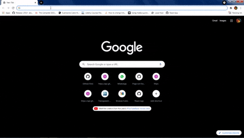

# Getting Started With GitHub Finder

This project was done to solidify my recently gotten, 26 Sept 2020, knowledge of a javascript framework, React.js.  
It was really nice working with third-party API's and i'll probably experiment more on that. Now to the main project.

## The web app in a large screen device >540px
 
## The web app in a small screen device <540px
 

### This project is not a project i'm proud of, so it's open source 🙂.

Next stop, state management systems and more complex react projects that won't be opensourced 🚴‍♂️.
